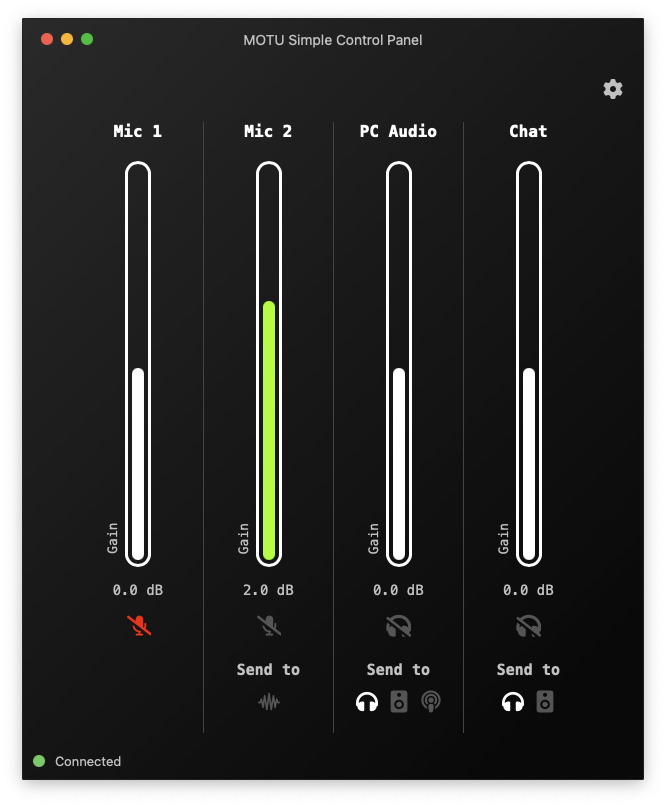

# MOTU Simple Control Panel (Unofficial)

This is a basic control panel I wrote for my [MOTU UltraLite AVB](https://motu.com/products/avb/ultralite-avb) audio interface.

The whole app is based on [Tauri](https://tauri.app/), with a [Next.js](https://nextjs.org/) frontend.

> This is a rewrite of my previous version made with Flutter



> Keep in mind that this app talks to my interface based on how I configured my input/output/mixer channels, your configuration will surely be different.

## How to use

On first launch, the app will show an alert notifying about the missing API URL inside the app settings. Head to the settings and insert the full **MOTU AVB API Datastore URL** in the dedicated field.

The URL will have a format similar to this:\
`http://localhost:1280/0001f2fffe012d80/datastore`

Once saved, return to the app home to use the interface.

## How it works

MOTU AVB audio interfaces have a build-in API you can use to get or set values.
Since they don't have a WebSocket, I had to use a Long Polling approach, that's exactly how the official webapp works.

### Reading from the API

- For each request, the API sends an **"ETag" Header**, that represents the number of times any parameter changed since boot.
- After each request, we save that ETag locally, then in the next request we send a "If-None-Match=<that_etag>", and if it does not match
with the ETag the interface has, it means something changed, so the interface will reply back **ONLY with the parameters that changed since the tag we sent**.\
If the ETag is the same, the interface will hang for 15 seconds waiting for possible changes, **if nothing changes it will reply with a status code 304**.
- Since we receive only "incremental data" from the API, we save everything in a `datastoreState` variable, and merge into that on every update.

### Writing to the API

- For the Faders, the API expects **Amplitude Ratio** values from a minimum of **0** (-∞dB) to a maximum of **4** (+12dB), so a conversion is needed, ad it's done with methods contained in the `lib/decibelUtils.js` file.\
In this app, I've adjusted faders to have a value that spans between a minimum of **-6dB** and a maximum of **6dB**.
- Toggle buttons in the API are 0 (OFF) or 1 (ON).

References:
- [MOTU AVB API Documentation](https://cdn-data.motu.com/downloads/audio/AVB/docs/MOTU%20AVB%20Web%20API.pdf)
- [Decibel Amplitude Ratio example table](https://en.wikipedia.org/wiki/Decibel)
- [Decibel to Amplitude Ratio formula](https://dsp.stackexchange.com/questions/22962/decibels-conversion-into-amplitude-ratio)

## Development

```sh
# Install Node dependencies
npm i

# Install Rust dependencies
cd src-tauri
cargo update

# Development server
npm run tauri dev

# Build release
npm run tauri build
```

> **Disclaimer**
    All product and company names are trademarks™ or registered® trademarks of their respective holders. Use of them does not imply any affiliation with or endorsement by them.
